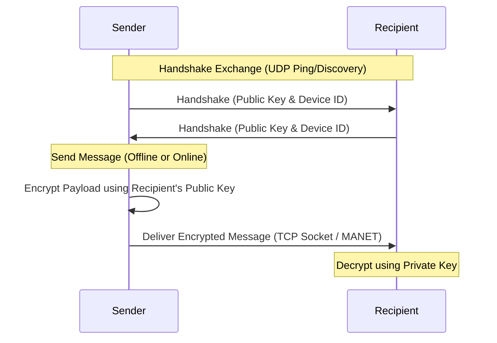

# Hyperlink

Hyperlink is a secure, off-grid chat and file sharing application that operates entirely without internet access or centralized servers. It utilizes a peer-to-peer Wi-Fi Direct mesh network combined with a dynamic MANET (Mobile Ad-Hoc Network) routing protocol to enable communication directly between nearby devices, supporting multi-hop packet relays.

---

## Key Features

*   **P2P Wi-Fi Direct Integration:** Directly connects nearby Android devices without requiring a local Wi-Fi router.
*   **Android Auto-Accept Service:** A custom native Kotlin background service that maps hardware MAC addresses to user profile names, bypassing Android OS pairing prompts to automatically accept incoming connection requests.
*   **MANET Multi-Hop Relaying (A ⇄ B ⇄ C):** Implements an ad-hoc routing protocol that dynamically propagates packets through intermediate devices to deliver messages to peers out of direct physical range.
*   **End-to-End Encryption (E2EE):** Automatically exchanges RSA public keys during network handshakes. All chat messages, images, and files are encrypted on the sender's device and decrypted only by the target recipient.
*   **Persistent Offline Delivery Queue:** Messages sent while a peer is offline are queued, encrypted, and stored locally in a persistent JSON cache. The queue automatically retries and delivers messages the moment the peer comes back online.
*   **Offline Contact Name Cache:** Offline peer profiles and names are persisted locally to prevent names from reverting to generic placeholders (`"Contact"`) upon app restart.
*   **High-Speed File & Image Sharing:** Supports high-speed P2P file transfers over TCP sockets with automatic resume support, integrity checks (SHA-256), and image preview galleries.
*   **One-Click Backup & Restore:** Easily backup the local Isar database to `Downloads/Hyperlink/` and restore chat history on new devices in one click.

---

## Technical Architecture

### 1. Ad-Hoc Routing (MANET)
The network layer (`ManetService`) broadcasts presence announcements periodically. Each device builds a dynamic `RoutingTable` mapping destinations, next-hop IP addresses, and hop counts.
*   **Direct Route (1 Hop):** Direct Wi-Fi Direct connection or UDP ping proximity.
*   **Relayed Route (>1 Hops):** Automatically forwarded through intermediate nodes using Route Request (RREQ), Route Reply (RREP), and Route Error (RERR) control packets.

### 2. Encryption Flow


---

## Setup & Running Instructions

### Prerequisites
*   **Flutter SDK:** `>=3.0.0`
*   **Android SDK:** Target API level `34` (Android 14) or lower.
*   **Devices:** Requires physical Android devices (Wi-Fi Direct is not supported on emulators).

### Running the App
1.  Connect your Android devices via USB and enable USB Debugging.
2.  Get dependencies:
    ```bash
    flutter pub get
    ```
3.  Generate the database bindings (Isar):
    ```bash
    dart run build_runner build --delete-conflicting-outputs
    ```
4.  Run the application:
    ```bash
    flutter run
    ```

---

## Offline Networking Usage
1.  Open **Hyperlink** on two or more devices.
2.  Enable Wi-Fi and Location permissions (required by Android for Wi-Fi Direct discovery).
3.  Go to the **Wi-Fi Direct Status** tab from the settings menu.
4.  Start **Scanning** to discover nearby peers. The background auto-accept registry will automatically initiate pairing and form P2P connections.
5.  Open the **Contacts** tab to start secure chatting and file sharing!
